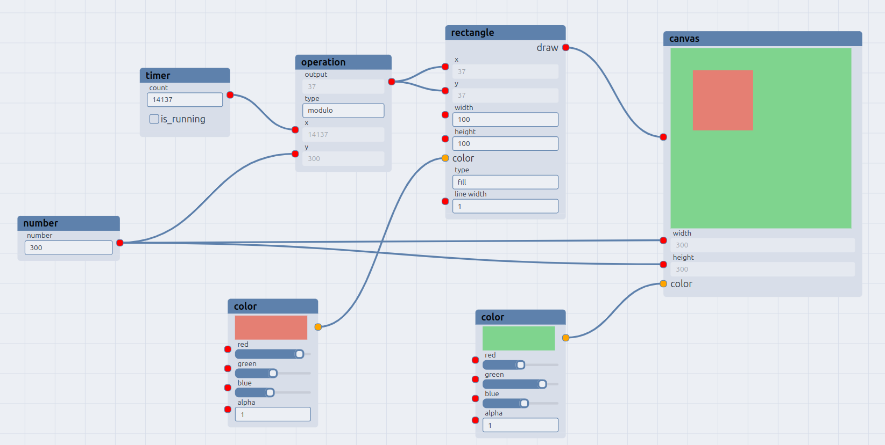

# oura-node-editor

A react component library that lets you create node based editors ! inspired by blender node editor.

Try me: [oura-canvas-creator](https://mathieuguyot.github.io/oura-canvas-creator/) !

[Documentation](https://mathieuguyot.github.io/oura-node-editor/docs/introduction)

Warning: Project in an experimental state, API may change a lot and npm repository is not up to date (so pull the lib and link it to your project if you wish test it!)

Example project that use the lib:

## current features:

-   Nodes can be created easelly. A node consists of a name, x/y position, a width, a selected state and 0 one or many connectors
-   A connector is a composed of two elements: pin layout (no-pins, left, rigth, left and right) and connector-content
-   Library provides generic connector-content: none, string, number, button, select, check-box
-   Nodes can be linked between each others using links
-   User can create they own connector-content (like the canvas in the oura-canvas-creator example project)
-   Node can be moved and their width can be resized
-   The working sheet where nodes are displayed can be zoomed in and out and dragged
-   One or many nodes and links can be selected
-   It is possible to extend the existing theme or create your own
-   Node rendering is virtualized (eg. node are not rendered if not displayed on screen), which improves general performances

## Install

`npm install oura-node-editor`

License MIT © [Mathieu Guyot](https://github.com/mathieuguyot)
